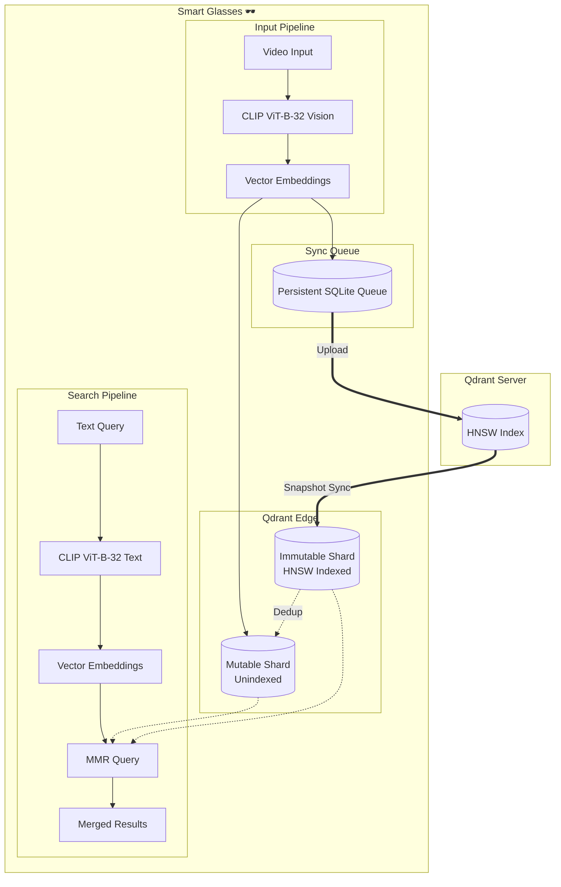

# Smart Glasses x Qdrant Edge

This is a proof-of-concept for smart glasses that remember what they see and help you find your keys even without an internet connection.

Powered by [Qdrant Edge](https://qdrant.tech/edge/).


## How?



The system has two main parts: the glasses with Qdrant Edge and the Qdrant server.

### On the device

The glasses use a [CLIP model](https://huggingface.co/Qdrant/clip-ViT-B-32-vision) to turn video frames into vectors. We compare frame similarity to skip redundant frames.

Vectors are stored locally in a mutable shard for immediate search. They're also pushed to a SQLite-backed queue that syncs to the server in the background. If the network drops, the queue holds onto data until connectivity returns.

### Sync & Index

Building the HNSW graph is CPU-heavy, so we offload it to the server. The glasses sync back the indexed data into an immutable shard.

We use this two-shard design to enable partial snapshots. Since the immutable shard is always an exact copy of the server, we can limit the snapshot download to only the new updates instead of the full database. Searches query both shards and merge results.

## Try it out

You'll need [`uv`](https://docs.astral.sh/uv/getting-started/installation/) and [Docker](https://docs.docker.com/desktop/setup/install/mac-install/) installed.

1. Start the server (handles the vector indexing):

```bash
docker run -d -p 6333:6333 qdrant/qdrant
```

2. Install dependencies and download the CLIP models:

```bash
make setup
```

3. Run the demo:

```bash
make backend & make demo
```
